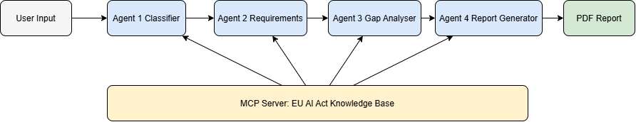

# 🛡️ EU AI Act Compliance Agent

   

> Autonomous multi-agent system that audits AI systems for EU AI Act compliance — classifies risk, maps legal obligations, identifies gaps, and generates actionable compliance reports.

🔴 **Live Demo:** https://eu-ai-act-compliance-agent-lgjghtlmfap46zcqnkasq3.streamlit.app

---

## 🎯 The Problem

The **EU AI Act** (Regulation 2024/1689) is the world's first comprehensive AI law. Key facts:

- **August 2, 2026** — Deadline for high-risk AI systems to comply with Chapter 2 obligations (Articles 9–15)
- **Fines up to €30 million** or 6% of global annual turnover for violations
- **8 high-risk categories** including hiring AI, credit scoring, medical diagnosis, and biometric systems
- **Most startups and developers have no idea** whether their AI system complies
- **No automated compliance tools exist** — companies rely on expensive lawyers charging €500/hour

---

## 💡 The Solution

An autonomous **4-agent pipeline** that takes a developer's description of their AI system and:

1. **Classifies** the system into the correct EU AI Act risk tier
2. **Maps** the exact legal obligations that apply
3. **Identifies gaps** between what is required and what exists
4. **Generates** a prioritised compliance report with action plan and PDF export

---

## 🏗️ Architecture



| Component | File | Purpose |
|---|---|---|
| Agent 1 — Classifier | `agents/classifier_agent.py` | Classifies AI system into risk tier using Annex III |
| Agent 2 — Requirements | `agents/requirements_agent.py` | Maps applicable Articles (9–15) for the risk tier |
| Agent 3 — Gap Analyser | `agents/gap_analyser_agent.py` | Compares requirements vs user responses, scores compliance |
| Agent 4 — Report Generator | `agents/report_generator_agent.py` | Generates structured report + PDF export |
| MCP Server | `mcp_server/server.py` | Serves EU AI Act knowledge base to all agents via MCP protocol |
| Master Pipeline | `main.py` | Connects all 4 agents, audit logging, input sanitisation |
| UI | `ui/app.py` | Streamlit web interface for developers |

---

## ✅ Course Concepts Demonstrated

| Course Concept | Where in Code |
|---|---|
| Multi-agent system (ADK) | `agents/` — 4 specialised agents running in sequence |
| MCP Server | `mcp_server/server.py` — FastMCP server with 4 tools |
| Security features | `main.py` — input sanitisation, prompt injection detection, audit logging |
| Deployability | Live on Streamlit Cloud — public URL above |
| Agent skills | Each agent has a single focused skill (classify / map / analyse / report) |

---

## 🛠️ Tech Stack

| Technology | Purpose |
|---|---|
| Python 3.12 | Core language |
| Google Gemini (gemini-2.5-flash-lite) | LLM reasoning for all agents |
| Google ADK | Agent development framework |
| Streamlit | Web UI |
| MCP (FastMCP) | Knowledge base protocol server |
| fpdf2 | PDF report generation |
| python-dotenv | Environment variable management |

---

## 🚀 Setup Instructions

```bash
# 1. Clone the repository
git clone https://github.com/diyashah5/eu-ai-act-compliance-agent.git
cd eu-ai-act-compliance-agent

# 2. Install dependencies
pip install -r requirements.txt

# 3. Add your Gemini API key
# Create a .env file with:
GOOGLE_API_KEY=your_gemini_key_here
# Get a free key at: https://aistudio.google.com/apikey

# 4. Run locally
streamlit run ui/app.py

# 5. Validate knowledge base
python validate_kb.py
```

---

## 📁 Project Structure

```
eu-ai-act-compliance-agent/
├── agents/
│   ├── classifier_agent.py       # Agent 1: Risk tier classification
│   ├── requirements_agent.py     # Agent 2: Legal obligations mapping
│   ├── gap_analyser_agent.py     # Agent 3: Compliance gap analysis
│   └── report_generator_agent.py # Agent 4: Report + PDF generation
├── mcp_server/
│   ├── server.py                 # FastMCP server (4 tools)
│   └── client.py                 # MCP client for agents
├── knowledge_base/
│   ├── annex_iii.json            # 8 high-risk system categories
│   ├── articles_obligations.json # Articles 9-15 requirements
│   └── risk_matrix.json          # 3-step classification logic
├── ui/
│   └── app.py                    # Streamlit web interface
├── docs/
│   └── architecture.png          # System architecture diagram
├── logs/
│   ├── session_log.json          # Audit trail of all checks
│   └── compliance_report.pdf     # Latest generated report
├── main.py                       # Master pipeline
├── validate_kb.py                # Knowledge base integrity check
├── requirements.txt
└── README.md
```

---

## ⚠️ Limitations

- **Not legal advice** — This tool provides preliminary analysis only. Consult qualified legal counsel for binding compliance decisions.
- **Self-reported input** — The system works with what developers describe. Inaccurate descriptions lead to inaccurate results.
- **Free tier limits** — Gemini API free tier allows 20 requests/day on gemini-2.5-flash-lite.
- **Evolving regulation** — The EU AI Act is still being updated (AI Omnibus May 2026 pushed some deadlines to Dec 2027).
- **EU scope** — Currently focused on EU AI Act. Does not yet cover GDPR, UK AI Bill, or US AI frameworks.

---

## 🔮 Future Roadmap

- [ ] GDPR integration (data protection obligations)
- [ ] UK AI Bill coverage
- [ ] US NIST AI Risk Management Framework
- [ ] Real-time regulation update monitoring via web search tool
- [ ] Multi-language support (German, French, Spanish)
- [ ] User accounts and persistent compliance history
- [ ] API endpoint for enterprise integration

---

## ⚖️ Disclaimer

This tool provides preliminary compliance analysis only and does not constitute legal advice. Providers are solely responsible for full regulatory compliance with the EU AI Act and all applicable laws. Consult qualified legal counsel for binding guidance.

---

## 🏆 Built for Kaggle AI Agents Capstone 2026

**Track:** Agents for Good

**Built by:** Diya Shah (diyashah5)

Powered by Google Gemini + MCP + Streamlit